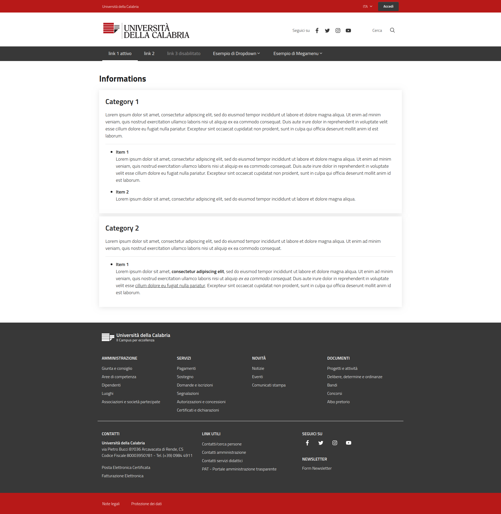

Info Manager app for Django Framework
-------------------------------------
Serves informational pages to users with multi language support.

Installation
------------

````
pip install -r requirements
````
Add `ckeditor` to the installed apps in `settings.INSTALLED_APPS`.

````
./manage.py migrate
````

Gallery
--------

_**Frontend**: Example informations_
